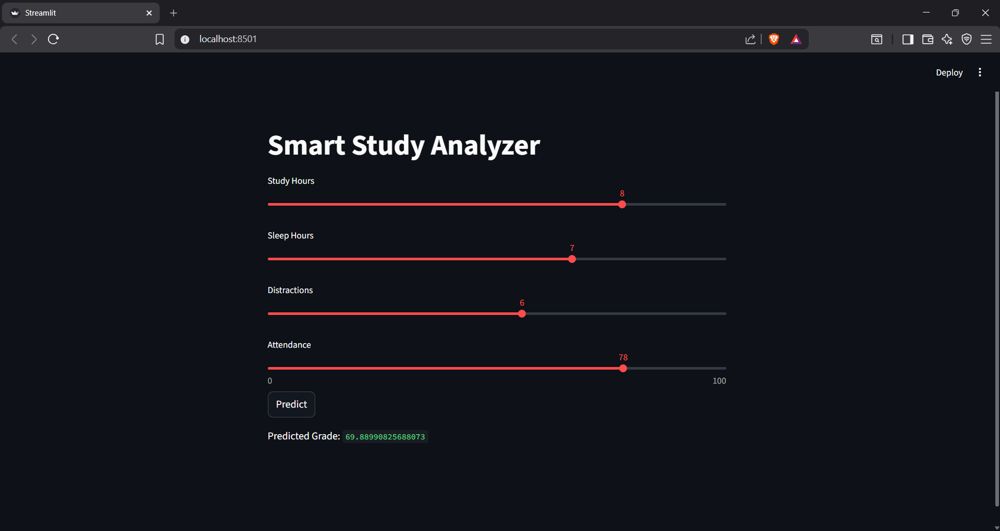

# 📊 Smart Study Pattern Analyzer

## 📌 Overview

The Smart Study Pattern Analyzer is a machine learning-based application that predicts student academic performance based on study habits such as study hours, sleep, distractions, and attendance. It also provides personalized recommendations to help improve performance.

---

## 🚀 Features

* 📈 Predicts student grades using ML model
* 🧠 Personalized study recommendations
* 🌐 Interactive web app using Streamlit
* 📊 Data analysis and visualization
* 📁 Scalable dataset (Big Data ready)

---

## 🛠️ Tech Stack

* **Language:** Python
* **Libraries:** Pandas, NumPy, Scikit-learn
* **Visualization:** Matplotlib / Seaborn
* **Web App:** Streamlit

---

## 📂 Project Structure

```
SmartStudyProject/
│
├── app.py
├── study_data_big.csv
├── notebook.ipynb
└── README.md
```

---

## ⚙️ Installation & Setup

### 1. Clone the repository

```
git clone https://github.com/swanandpande05/smart-study-analyzer.git
cd smart-study-analyzer
```

### 2. Install dependencies

```
pip install pandas numpy scikit-learn streamlit matplotlib seaborn
```

### 3. Run the application

```
streamlit run app.py
```

---

## 📊 How It Works

1. User inputs study-related parameters
2. Data is processed using Pandas
3. Machine Learning model predicts grade
4. System provides improvement suggestions

---

## 🎯 Objectives

* Analyze student behavior using data
* Predict academic performance
* Provide actionable recommendations

---

## 📸 Screenshots


---

## 🔮 Future Improvements

* Use advanced models (Random Forest, XGBoost)
* Add real-time data collection
* Deploy online (Streamlit Cloud)
* Mobile-friendly UI

---

## 👨‍💻 Author

* Swanand Pande

---

## 📜 License

This project is for academic and educational purposes.
